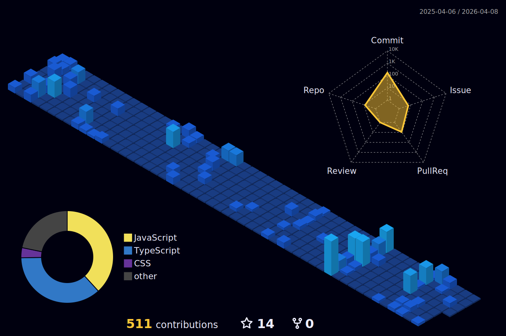

<h1 align="center">Ayo👋, This is Amit Singh Rawat</h1>
<h3 align="center">A passionate <strong>Fullstack</strong> developer</h3>

  
  
  
  

 

<h3 align="left">🛠️ Languages and Tools:</h3>

- **Backend**

  

- **Frontend**

  

- **Database**

  

- **Cloud & DevOps**

  

- **Tools**

  

 

<h3 align="center">📊 GitHub Stats</h3>

  
  
   
  
  

   
   

  

 

  <picture>
    <source media="(prefers-color-scheme: dark)" srcset="https://raw.githubusercontent.com/amitsinghrawat777/amitsinghrawat777/pacman/pacman-contribution-graph-dark.svg">
    <source media="(prefers-color-scheme: light)" srcset="https://raw.githubusercontent.com/amitsinghrawat777/amitsinghrawat777/pacman/pacman-contribution-graph.svg">
    
  </picture>

